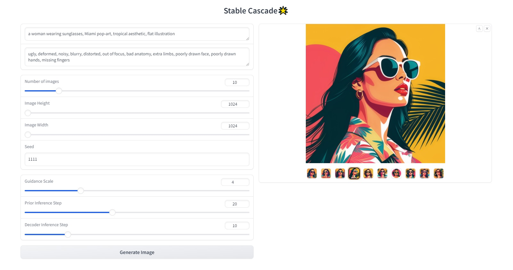
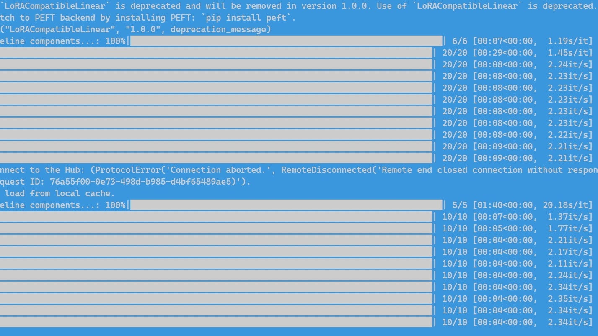

# Stable Cascade WebUi
A browser interface for Stable Cascade.

# Performance
Performance on a GeForce RTX 3060 video card; at default settings, one image takes ~15 seconds.

# Installation and Run:
1. Download and unpack the repository. https://github.com/ThetaCursed/stable-cascade-webui/archive/refs/heads/main.zip
2. Run install.bat
3. After installation is complete, run WebUI.bat

